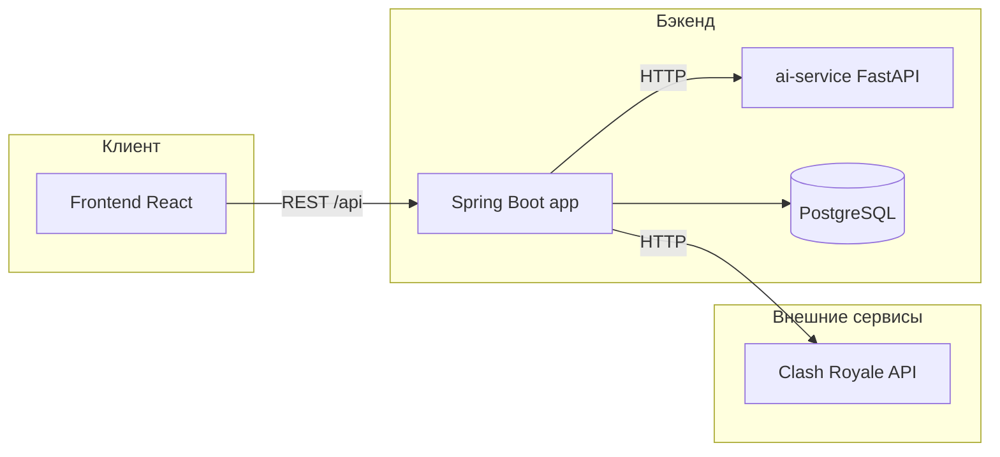

# Описание бэкенда ClashRoyaleAnalitics

Документ описывает архитектуру, стек, структуру кода и REST API Java-бэкенда проекта.

## Назначение проекта

Веб-приложение для **аналитики Clash Royale**: регистрация пользователя, привязка игрового тега, просмотр профиля и статистики, управление колодами, сравнение колод (1v1) и генерация колод с помощью аналитического сервиса.

---

## Общая архитектура

Приложение состоит из четырёх основных компонентов, которые поднимаются через `docker-compose.yml`:

| Сервис | Технология | Порт (в Docker) | Назначение |
|--------|------------|-----------------|------------|
| **app** | Java 17, Spring Boot 4 | 8080 (внутренний) | REST API, бизнес-логика, работа с БД |
| **postgres** | PostgreSQL 16 | 5432 | Постоянное хранение данных |
| **ai-service** | Python, FastAPI | 8000 (внутренний) | Генерация колод и сравнение (скоринг) |
| **frontend** | React, nginx | 80 | Пользовательский интерфейс |

Дополнительно используется **внешний API Supercell**:

- Базовый URL: `https://api.clashroyale.com/v1`
- Требуется токен разработчика: переменная окружения `CLASH_ROYALE_API_TOKEN`

Все HTTP-запросы к бэкенду имеют префикс **`/api`** (настроено в `application.properties`: `server.servlet.context-path=/api`).

Пример: `POST http://localhost:8080/api/auth/login` (локально) или через nginx в Docker на порту 80.



---

## Стек технологий (бэкенд)

- **Java 17**, **Spring Boot 4** (`pom.xml`)
- **Spring Web** — REST-контроллеры
- **Spring Data JPA** — работа с PostgreSQL
- **Spring Security** — CORS, BCrypt для паролей (без JWT-фильтра на уровне Security)
- **Flyway** — миграции схемы БД (`src/main/resources/db/migration/`)
- **RestClient** — HTTP-клиенты к Clash Royale API и ai-service
- **PostgreSQL 16** — основная БД

Точка входа приложения: `ClashroyalebackApplication.java`.

---

## Структура исходного кода

Пакет: `egorteam.clashroyaleback`

```
src/main/java/egorteam/clashroyaleback/
├── api/              # REST-контроллеры, DTO, обработка ошибок
├── service/          # Бизнес-логика
├── persistence/      # JPA-сущности, репозитории, JsonMapper
├── external/         # HTTP-клиенты (Clash Royale, AI)
└── config/           # Security, CORS, Flyway, RestClient
```

### Слои и ответственность

| Слой | Папка | Роль |
|------|-------|------|
| API | `api/` | Приём HTTP-запросов, валидация DTO, вызов сервисов |
| Service | `service/` | Бизнес-правила, транзакции, оркестрация внешних вызовов |
| Persistence | `persistence/` | Сущности JPA, репозитории, сериализация JSON в поля БД |
| External | `external/` | Интеграция с Clash Royale API и Python ai-service |
| Config | `config/` | Настройка Spring (безопасность, миграции, бины) |

Типичный поток запроса:

1. Контроллер получает запрос и извлекает пользователя из `Authorization: Bearer …` (через `AuthService.requireUser()`).
2. Сервис выполняет логику, обращается к репозиториям и при необходимости к внешним клиентам.
3. Результат маппится в DTO (`api/Dtos.java`) и возвращается клиенту.

---

## База данных

Схема создаётся миграцией Flyway: `src/main/resources/db/migration/V1__init.sql`.

Hibernate настроен в режиме **`ddl-auto=validate`** — только проверка соответствия схемы, без автогенерации таблиц.

### Таблицы

| Таблица | Назначение |
|---------|------------|
| `users` | Пользователи: `player_tag` (PK), username, email, password (BCrypt), дата регистрации |
| `auth_tokens` | Access и refresh токены, привязка к `player_tag` |
| `cards` | Справочник карт (кэш с официального API) |
| `user_preferences` | Настройки для генерации: стратегия, эликсир, любимые/исключённые карты (JSON) |
| `profile_caches` | Кэш профиля игрока CR: трофеи, колода, награды, статистика боёв |
| `rating_points` | История изменения рейтинга (трофеев) |
| `decks` | Колоды пользователя: карты и метрики в JSON |
| `public_decks` | Публичные ссылки на опубликованные колоды |
| `comparisons` | История сравнений колод 1v1 (баллы, победитель, описание) |

---

## Авторизация и безопасность

### Регистрация и вход

- **Регистрация** (`POST /api/auth/register`): username, email, password, player tag из Clash Royale. Тег нормализуется (верхний регистр, префикс `#`). Создаётся запись в `users` и пустые `user_preferences`.
- **Вход** (`POST /api/auth/login`): проверка username и пароля через `BCryptPasswordEncoder`.
- **Обновление токенов** (`POST /api/auth/refresh`): по refresh-токену выдаётся новая пара access + refresh.

Токены хранятся в таблице `auth_tokens` и возвращаются клиенту в теле ответа.

### Проверка запросов

Spring Security (`SecurityConfig`) **не блокирует** эндпоинты (`anyRequest().permitAll()`), отключён CSRF. CORS разрешён для локального фронта (`localhost:5173`).

Защита реализована **вручную** в сервисах: заголовок `Authorization: Bearer <access_token>`, метод `AuthService.requireUser()` находит токен в БД и возвращает `Account`.

Пароли в БД только в виде хэша BCrypt.

---

## REST API

Базовый путь: `/api`.

### Авторизация — `/api/auth`

| Метод | Путь | Описание |
|-------|------|----------|
| POST | `/auth/register` | Регистрация |
| POST | `/auth/login` | Вход, выдача токенов |
| POST | `/auth/refresh` | Обновление пары токенов |

Контроллер: `AuthController.java`. Логика: `AuthService.java`.

### Профили — `/api/profiles`

| Метод | Путь | Описание |
|-------|------|----------|
| POST | `/profiles/link-cr-account` | Привязка/смена тега Clash Royale |
| GET | `/profiles/me` | Текущий профиль |
| PUT | `/profiles/me` | Обновление username/email |
| GET | `/profiles/me/dashboard` | Данные для дашборда |
| POST | `/profiles/me/refresh` | Обновить кэш с API Supercell |
| GET | `/profiles/{playerTag}` | Профиль по тегу |
| GET | `/profiles/{playerTag}/rating-history` | История рейтинга |

Контроллер: `ProfileController.java`. Логика: `ProfileService.java` (кэш в `profile_caches`, запись точек в `rating_points`).

### Колоды — `/api`

| Метод | Путь | Описание |
|-------|------|----------|
| GET | `/decks` | Список колод пользователя |
| POST | `/decks` | Создать колоду |
| GET | `/decks/{deckId}` | Детали колоды |
| PUT | `/decks/{deckId}` | Обновить колоду |
| DELETE | `/decks/{deckId}` | Удалить колоду |
| POST | `/decks/{deckId}/publish` | Опубликовать (публичный токен) |
| GET | `/public/decks/{publicToken}` | Просмотр опубликованной колоды (без авторизации) |

Контроллер: `DeckController.java`. Логика: `DeckService.java`.

### Карты — `/api/cards`

| Метод | Путь | Описание |
|-------|------|----------|
| GET | `/cards` | Список карт (фильтры, пагинация) |
| GET | `/cards/{cardId}` | Одна карта |

Контроллер: `CardsController.java`. Логика: `CardsService.java` (синхронизация/чтение из таблицы `cards`).

### Пользователь — `/api/users`

| Метод | Путь | Описание |
|-------|------|----------|
| GET | `/users` | Данные текущего пользователя |
| GET | `/users/preferences` | Настройки генерации колод |
| PUT | `/users/preferences` | Обновить настройки |

Контроллер: `UserController.java`.

### ИИ-аналитика — `/api/ai`

| Метод | Путь | Описание |
|-------|------|----------|
| POST | `/ai/generate-deck` | Сгенерировать колоду по ограничениям |

Контроллер: `AiController.java`. Логика: `AnalyticsService.java` → вызов `AiAnalyticsClient` → сохранение колоды при `saveResult: true`.

### Сравнение 1v1 — `/api/one-vs-one`

| Метод | Путь | Описание |
|-------|------|----------|
| POST | `/one-vs-one/compare` | Сравнить две колоды |
| GET | `/one-vs-one/history` | История сравнений пользователя |

Контроллер: `OneVsOneController.java`. Логика: `AnalyticsService.java` (результат сохраняется в `comparisons`).

DTO для запросов и ответов собраны в `api/Dtos.java`. Ошибки API обрабатывает `ApiExceptionHandler.java`.

---

## Внешние интеграции

### ClashRoyaleClient

Файл: `external/ClashRoyaleClient.java`.

HTTP-клиент к официальному API Supercell. Основные методы:

- `getPlayer(playerTag)` — профиль игрока
- `getBattleLog(playerTag)` — лог боёв
- `getCards()` — список карт для синхронизации справочника
- `normalizeTag(playerTag)` — нормализация тега (`#`, верхний регистр)

Токен передаётся в заголовке запросов к API (см. реализацию клиента).

### AiAnalyticsClient

Файл: `external/AiAnalyticsClient.java`.

Прокси к Python-сервису (`ai-service`):

| Переменная окружения | По умолчанию | Назначение |
|----------------------|--------------|------------|
| `AI_ANALYTICS_BASE_URL` | — | Базовый URL (в Docker: `http://ai-service:8000`) |
| `AI_ANALYTICS_GENERATE_DECK_PATH` | `/generate-deck` | Генерация колоды |
| `AI_ANALYTICS_COMPARE_PATH` | `/compare` | Сравнение колод |

**Роль Java-бэкенда:** валидация, загрузка карт из БД, сохранение колод и истории сравнений.

**Роль ai-service:** расчёт оценок, подбор карт, текстовое объяснение (см. `ai-service/main.py`).

---

## Ключевые сервисы

| Сервис | Файл | Задачи |
|--------|------|--------|
| `AuthService` | `service/AuthService.java` | Регистрация, вход, refresh, проверка Bearer-токена |
| `ProfileService` | `service/ProfileService.java` | Профиль, дашборд, кэш CR, история рейтинга |
| `DeckService` | `service/DeckService.java` | CRUD колод, публикация |
| `CardsService` | `service/CardsService.java` | Справочник карт, фильтрация |
| `AnalyticsService` | `service/AnalyticsService.java` | Генерация колод и сравнение через AI |

Модель текущего пользователя в коде: `Account` (`service/Account.java`) — player tag, username, email и т.д.

---

## Конфигурация

### application.properties

Основные параметры:

```properties
server.servlet.context-path=/api
clashroyale.api.base-url=https://api.clashroyale.com/v1
clashroyale.api.token=${CLASH_ROYALE_API_TOKEN:}
spring.datasource.url=...
spring.jpa.hibernate.ddl-auto=validate
spring.flyway.enabled=true
```

### Переменные окружения (Docker / локально)

| Переменная | Описание |
|------------|----------|
| `CLASH_ROYALE_API_TOKEN` | Токен API Supercell (обязателен для работы с профилем и картами) |
| `SPRING_DATASOURCE_URL` | JDBC URL PostgreSQL |
| `SPRING_DATASOURCE_USERNAME` / `PASSWORD` | Учётные данные БД |
| `AI_ANALYTICS_BASE_URL` | URL Python-сервиса |

Пример для локальной разработки: `.env.example` (скопировать в `.env`).

---

## Запуск

### Весь стек (рекомендуется для демо)

```bash
docker compose up --build
```

- Фронт: http://localhost (порт 80)
- PostgreSQL: localhost:5432 (логин/пароль `clash` / `clash`, БД `clashroyale`)
- Бэкенд и ai-service доступны внутри Docker-сети

Перед запуском задать `CLASH_ROYALE_API_TOKEN` в `.env` или в окружении.

### Только бэкенд (разработка)

1. Поднять PostgreSQL (`docker compose up postgres` или локальный инстанс).
2. Указать переменные в `application.properties` или env.
3. Запуск: `./mvnw spring-boot:run` (Windows: `mvnw.cmd spring-boot:run`).

---

## Связь с фронтендом

Клиентские запросы описаны в `frontend/js/api/`:

- `auth.ts`, `profiles.ts`, `decks.ts`, `cards.ts`, `ai.ts`
- Общий HTTP-клиент: `frontend/js/api/client.ts` (базовый URL, заголовок Authorization)

В production nginx (`frontend/nginx.conf`) проксирует API-запросы на контейнер `app`.

---

## Краткая формулировка для защиты

> Бэкенд реализован на **Spring Boot** и **PostgreSQL**: REST API для пользователей, колод и кэша профиля Clash Royale. Данные игрока и карт получаем из **официального API Supercell**. Аналитику колод (генерация и сравнение) вынесли в отдельный **Python-сервис (FastAPI)**; Java-слой оркестрирует запросы и сохраняет результаты в БД. Развёртывание — **Docker Compose** (postgres, app, ai-service, frontend).

---

## Связанная документация в репозитории

- `documetation/ERD + описание (1).pdf` — ER-диаграмма
- `documetation/Диаграмма компонентов (1).pdf` — диаграмма компонентов
- `docker-compose.yml` — состав сервисов
- `src/main/resources/db/migration/V1__init.sql` — полная схема БД
